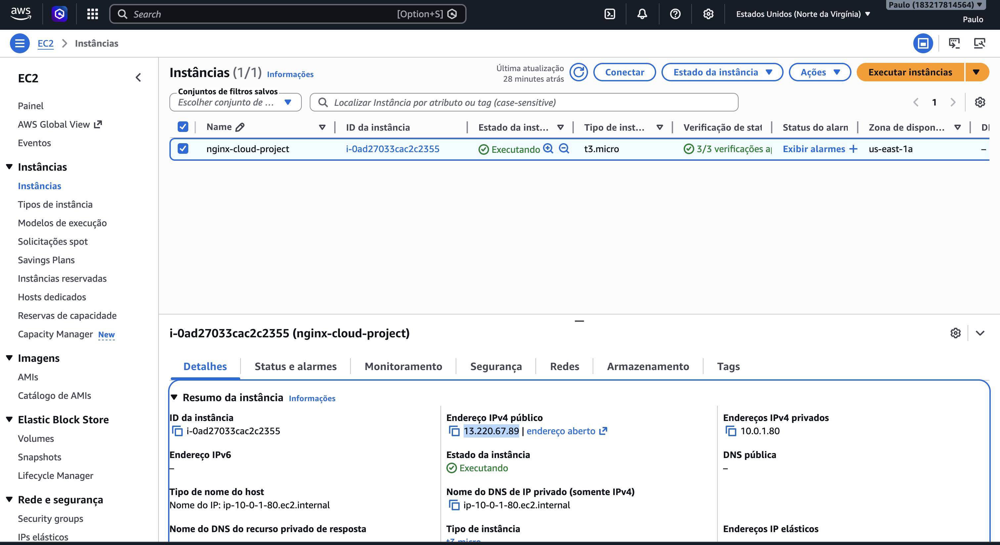
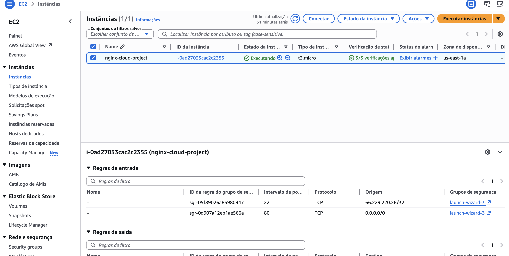

# 🚀 AWS EC2 Nginx Deployment

This project demonstrates how to deploy a static website on AWS EC2 using Nginx.

---

## 📌 Project Overview

- Launch EC2 instance (Amazon Linux 2023)
- Configure Security Groups (SSH + HTTP)
- Install and configure Nginx
- Deploy a custom HTML page

---

## 🛠️ Tech Stack

- AWS EC2
- Amazon Linux
- Nginx
- SSH

---

## 📸 Proof of Work

### 🟢 EC2 Running


### 🔐 Security Group (HTTP + SSH)


### ⚙️ Nginx Running


### 🌐 Live Website


---

## 🌍 Live Demo

http://13.220.67.89

---

## ⚡ Commands Used

```bash
sudo dnf install nginx -y
sudo systemctl start nginx
sudo systemctl enable nginx
